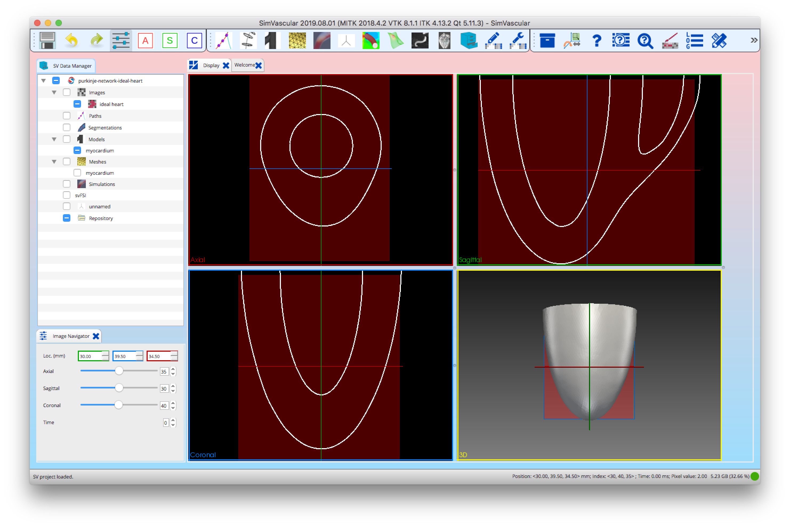
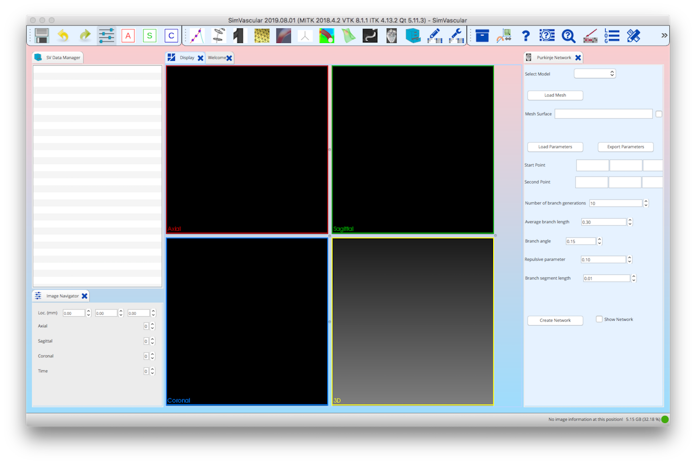
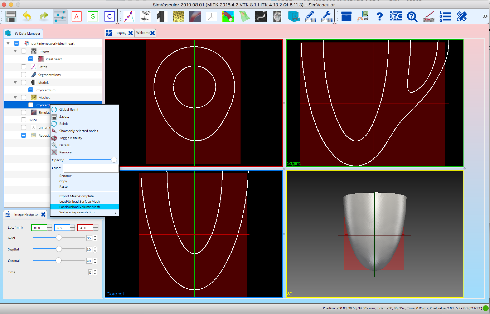
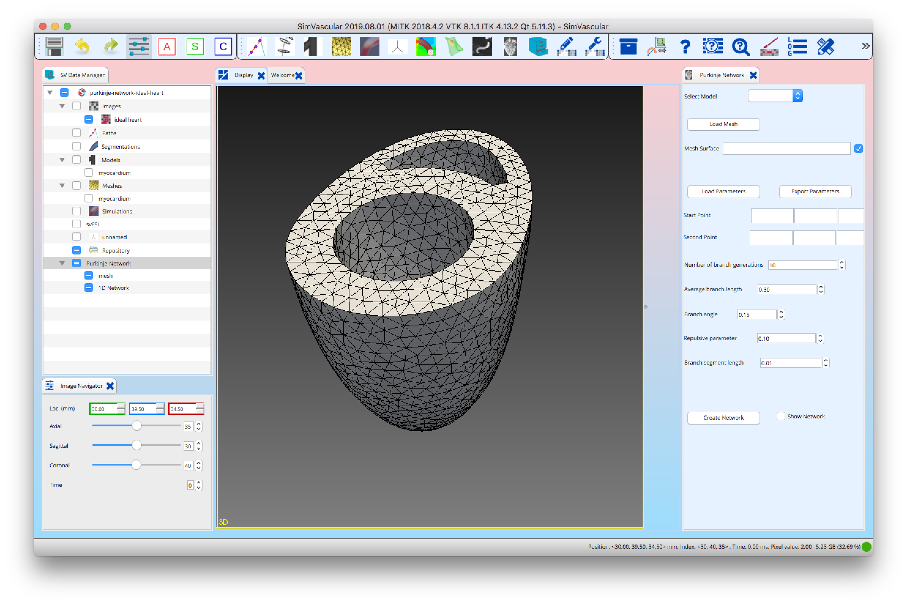
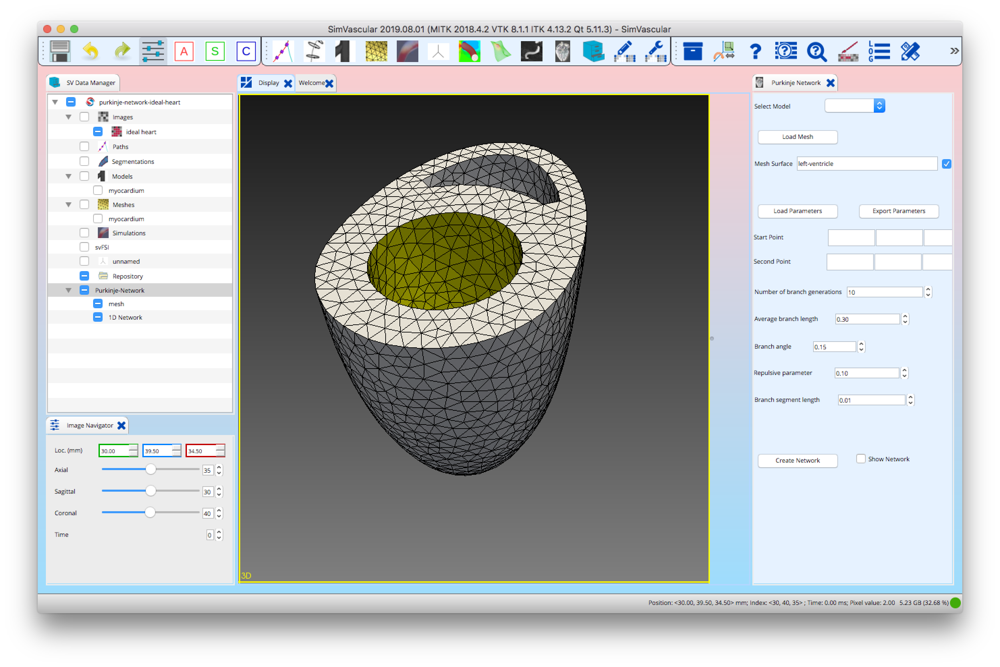
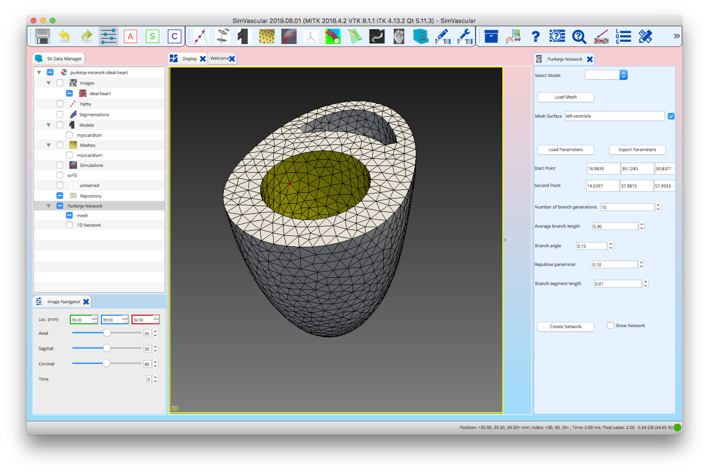
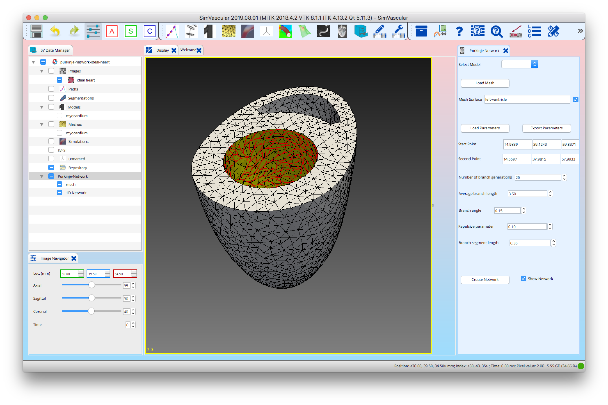

# SimCardio
This is the repository for the SimCardio project. The project currently contains only the Purkinje Plugin.

> The Purkinje Plugin code is under active developement and is not stable. There is limited error checking in the Python script and the GUI is still in developement.

# Purkinje Plugin
The Purkinje Plugin is a custom SimVascular plugin used to create a Purkinje network on a surface model of the heart. When loaded into SimVascular the Purkinje Plugin adds a **Purkinje Network** tool to the SimVascular menu bar. 

A geometric model of a heart is first created using SimVascular **Paths**, **Segmentations** and **Models** tools. The geometric model may also be imported using the **Models** tool. Model faces are extracted and assigned names and types (cap or wall) using the **Models** tool. The **Meshes** tool is then used to create a finite element tetrehedral mesh of the geometric model. The triangular surfaces of this mesh are identified with the model faces named in the **Models** tool.

When the **Purkinje Network** tool is activated it displays the triangular surfaces of the mesh. A Purkinje network is created using the **Purkinje Network** tool using the following steps
```
1) Select a face on the mesh
2) Select the network starting point on the face
3) Set network generation parameters
4) Generate the network
5) Display the network
```

The Purkinje network is generated using a Python script. The input to the script is a triangular surface, a network starting point, a second point defining the direction of the first network branch, and the parameters used to control the shape of the network.

The parameters used to generated the network are 

- Starting point - Initial node of the network.
- Second point - Defines the direction in which the network initial branch will grow.
- Number of branch generations - The maximum number of network branches generated from the initial node.
- Average branch length - Average length L of the branches. The length of each branch is calculted from a random normal distribution with mean L and variance 0.4*L^2. 
- Branch angle - Angle with respect to the direction of the previous branch and the new branch.
- Repulsive parameter - Regulates the branch curvature: the larger the repulsion parameter, the more the branches repel each other.
- Branch segment length - Approximate length of the segments that compose one branch (the length of a branch is random).

The  **Purkinje Network** tool writes files to the SimVascular project **Purkinje-Network** directory. The files are prefixed with a face name. The following files are created for each network

```
FACENAME.vtp - Triangular surface the network is generated on.
FACENAME.vtu - Network geometry represented as polylines of n segments and n+1 nodes.
FACENAME_endnodes.txt - Indices of nodes at the ends of network segments (i.e. not connected to other nodes).
FACENAME_ien.txt - Network connectivity as a list of node indices into FACENAME_xyz.txt.
FACENAME_xyz.txt - Network node coordinates.
```

## Building the Purkinje Plugin Shared Libraries
The shared libraries defining a SimVascular custom plugin are built from the Purkinje Plugin project source using CMake. The Purkinje Plugin CMake code uses CMake macros from the SimVascular project and the CMake.config file from a local SimVascular build so a SimVascular local build must be present. The Purkinje Plugin is built from source using the following steps

```
git clone https://github.com/SimVascular/SimCardio.git
cd SimCardio
mkdir build
cd build
ccmake -DACCEPT_DOWNLOAD_EXTERNALS=ON ..
make 
```

Next set the environment variables that SimVascular uses to identify and load custom plugins

```
cd $PROJECT_DIR/SimCardio 
export SV_CUSTOM_PLUGINS=$SV_CUSTOM_PLUGINS:org_sv_gui_qt_purkinjenetwork
export SV_PLUGIN_PATH=$SV_PLUGIN_PATH:$PWD/build/lib/plugins/
export LD_LIBRARY_PATH=$PWD/build/lib/
```
To use the Purkinje Plugin with the local SimVascular development build the **sv** launch script in SimVascular/build/SimVascular-build must be modified to use the Purkinje Plugin developement shared libraries and Python scripts rather than those that might be installed.

In the $PROJECT_DIR/SimVascular/build/SimVascular-build/sv script

  1) Comment out: 

        'export SV_PLUGIN_INSTALL_DIR=' 

   2) Add: 

        export PYTHONPATH=$PYTHONPATH:$PROJECT_DIR/SimCardio/Modules/PurkinjeNetwork/python/fractal-tree/:

      after: 

       export PYTHONPATH=$PYTHONPATH:$SV_PLUGIN_PATH


## Building the Purkinje Plugin Installer
The Purkinje Plugin installer is created using the following steps
```
cd build
cpack
```

## Installing the Purkinje Plugin
The installer installs the Purkinje Plugin  shared libraries, a setup.sh script and Python script in
```
Unix and MacOs: /usr/local/sv/svplugins/SVDATE/Purkinje-Plugin/PLUGINDATE
```
The setup.sh script sets the **SV_CUSTOM_PLUGINS** and **SV_PLUGIN_PATH** environment variables. The **SV_CUSTOM_PLUGINS** environment variable defines the name of the pluging (org_sv_gui_qt_purkinjenetwork) and the **SV_PLUGIN_PATH** environment variable defines the locatation of the plugin shared library (e.g. liborg_sv_gui_qt_purkinjenetwork.so).

Note that **SVDATE** must match the date of the installed SimVascular application. To work around this restriction you can modify **SVDATE** to match the installed SimVascular application. This should work with the latest installed SimVascular application that uses the latest externals.

## Using the Purkinje Plugin 
The SimVascular application starts by executing a launch script that looks for plugins in the plugin install directory. When a plugin is found its setup.sh script is executed. The SimVascular application is then executed and loads in core and then custom plugins. Plugins are loaded using the plugin shared library (e.g. liborg_sv_gui_qt_purkinjenetwork.so).

If the plugin is successfully loaded you will see the **Purkinje Network** tool icon  on the SimVascular toolbar.

Example projects are found in the **example-projects** directory under the SimCardio project.

# Purkinje Plugin ideal heart project
The Purkinje Plugin ideal heart project generates a Purkinje network on an idealized geometric model of the heart. The project is loaded from the **example-projects/purkinje-network-ideal-heart** directory under the SimCardio project.

 

> When starting SimVascular a **Purkinje Network** tool panel may be present before a project is opened. Delete this tool before opening a project.



The **Purkinje Network** tool uses a mesh generated by a **Meshes** tool. A mesh must be first loaded before adding the **Purkinje Network** tool. A mesh is loaded by right clicking on the **SV Data Manager** **Meshes/myocardium** data node and select **Load/Unload Volume Mesh**.

 

Now select the **Purkinje Network** tool icon  on the SimVascular toolbar. This brings up the **Purkinje Network** tool panel. The mesh read in to the **Meshes/myocardium** data node is displayed in the graphics window. 

 

A mesh face is selected by moving the mouse cursor over a face and pressing the **s** key. Select the left ventricle face. The face surface mesh is highlighed in yellow and its name is displayed in the **Mesh Surface** text box.

 

Now select a starting point of the Purkinje network by moving the mouse cursor to a node on the face surface mesh and pressing control-left-mouse-button (on the Mac this is command-left-mouse-button). A red sphere marking the node selected and a red line showing the direction of the second point is displayed.

 

After adjusting some parameters the Purkinje network is created by selecting the **Create Network** button. The network is displayed by selecting the **Show Network** checkbox.

 


